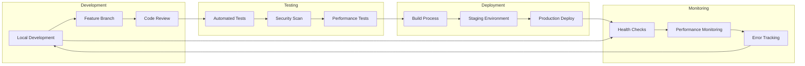

# Deployment Pipeline

## CI/CD Flow


## Infrastructure as Code
```yaml
# Vercel Configuration
name: forma
version: 2
builds:
  - src: package.json
    use: '@vercel/next'

# Environment Variables
env:
  DATABASE_URL: @database-url
  NEXTAUTH_SECRET: @nextauth-secret


# Supabase Infrastructure
# Create project at supabase.com, then configure:
# - DATABASE_URL from Project Settings > Database
# - NEXT_PUBLIC_SUPABASE_URL and SUPABASE_SERVICE_ROLE_KEY from Project Settings > API
# - Storage buckets created in Supabase Dashboard > Storage
```

## Deployment Commands
```bash
# Development
npm run dev              # Local development
npm run build           # Build for production
npm run start           # Start production server

# Staging
vercel --env staging    # Deploy to staging
vercel --env preview    # Deploy preview

# Production
vercel --prod           # Deploy to production
vercel --env production # Set production environment

# Database
npx prisma migrate dev  # Apply migrations
npx prisma db push      # Push schema changes
npx prisma studio       # Open database GUI
```

## Rollback Strategy
```bash
# Quick Rollback
vercel rollback         # Rollback to previous deployment

# Database Rollback
npx prisma migrate reset # Reset to clean state
npx prisma migrate deploy # Deploy specific migration

# Environment Rollback
vercel env rm           # Remove environment variable
vercel env add          # Add previous environment variable
```
